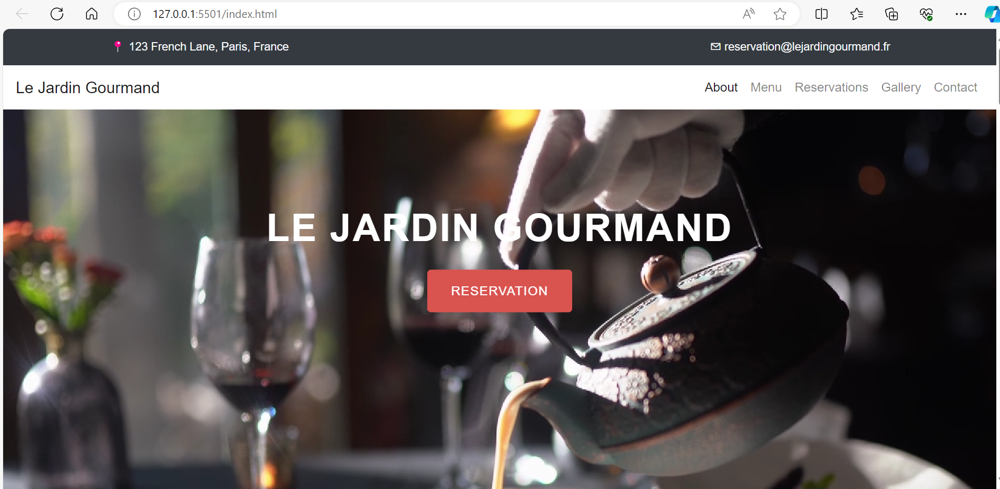
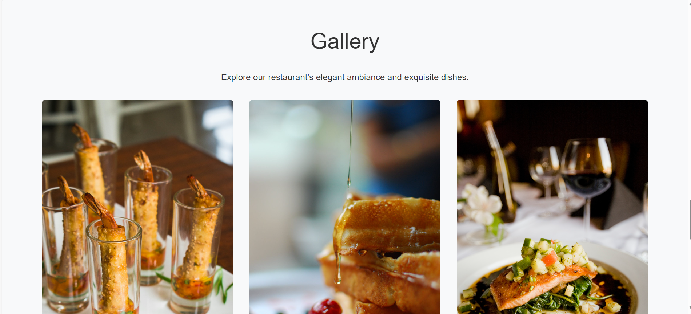

# restaurant-website
 created with HTML, CSS, Bootstrap, Javascript
# Le Jardin Gourmand Website

## Project Overview
Le Jardin Gourmand is a modern, responsive website designed for a fictional high-end restaurant located in Paris, France. It showcases the restaurant's philosophy, menu, and reservation information.

## Features
- **Responsive Design:** The website is fully responsive and adapts to various screen sizes to ensure it looks great on all devices, from mobile phones to desktop computers.
- **Interactive Menu:** A dynamic menu section featuring a carousel for different food categories allows users to browse the restaurant's offerings.
- **Reservation System:** An integrated reservation form allows customers to make reservations online.

## Technologies Used
- **HTML5:** For structuring the content and layout of the website.
- **CSS3:** For styling, including Flexbox and Grid for responsive layouts.
- **JavaScript (optional):** For interactive components like the carousel and form validations.
- **Bootstrap (optional):** For responsive design components and utilities.

## Setup and Installation
1. Clone the repository to your local machine using `git clone https://example.com/lejardingourmand.git`
2. Open the `index.html` file in a web browser to view the website.
3. Explore the various sections from the navigation bar to learn more about Le Jardin Gourmand.

## File Structure
- `index.html` - The main HTML document for the homepage.
- `full-menu.html` - The HTML document for the menu page.
- `css/style.css` - The main stylesheet containing custom styles.
- `js/script.js` - (If applicable) The main JavaScript file containing scripts for interactive features.
- `images/` - Directory containing images, fonts, and other static assets.

## Screenshot

## Contact
For support or business inquiries, reach out to me at nancyuki@yahoo.com.

## Acknowledgments
- Photos provided by [Unsplash](https://unsplash.com/).
- Photos provided by [Pexels](https://pexels.com/).
- Icons made by [Font Awesome](https://fontawesome.com/).

## Final Notes
This project is for demonstration purposes and part of a portfolio to showcase web development skills.
